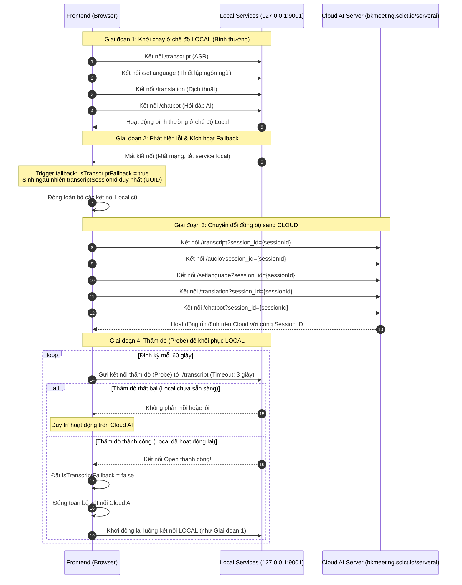
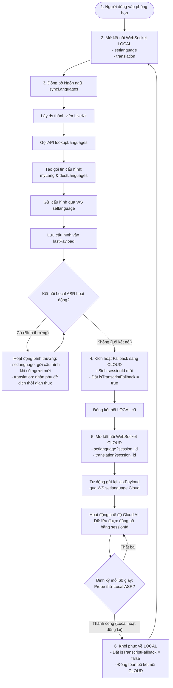

# Hướng Dẫn Cơ Chế Dự Phòng (Fallback) và Khôi Phục (Recovery) Đồng Bộ

Tài liệu này cung cấp sơ đồ, thời gian cấu hình và chi tiết hoạt động của cơ chế dự phòng đồng bộ cho toàn bộ các kênh WebSocket (`ASR Transcript`, `Audio Micro`, `SetLanguage`, `Translation`, `Chatbot`) trên Frontend khi gặp sự cố kết nối Local.

---

## 1. Sơ Đồ Tuần Tự (Sequence Diagram - Luồng Chuyển Đổi Dự Phòng)

Sơ đồ này minh họa cách hệ thống tự động phát hiện sự cố từ cổng Local ASR, chuyển đổi đồng bộ toàn bộ các kênh kết nối khác sang Cloud AI Server sử dụng chung một `session_id`, và khôi phục khi phát hiện Local hoạt động trở lại:



---

## 2. Sơ Đồ Luồng Quyết Định (Flowchart - SetLanguage & Translation)

Sơ đồ luồng logic dưới đây mô tả cách hệ thống đồng bộ danh sách ngôn ngữ dịch thuật (`setlanguage`) và tiếp nhận phụ đề dịch (`translation`) trong cả hai chế độ:



---

## 3. Các Mốc Thời Gian Cấu Hình (Timings & Delays)

| Tên Hoạt Động | Thời Gian Chờ (Delay / Interval) | Cơ Chế Xử Lý | Vị Trí Cấu Hình trong Code |
| :--- | :--- | :--- | :--- |
| **Kích hoạt Fallback** | **Tức thì (~10ms - 100ms)** | Kích hoạt ngay khi nhận tín hiệu lỗi kết nối Local lần đầu tiên | `TranscriptRoomProvider.tsx` |
| **Thời gian bắt tay kết nối Cloud** | **~200ms - 600ms** | Bao gồm DNS, TCP handshake, TLS/SSL handshake và WS Upgrade | Trình duyệt xử lý |
| **Độ trễ đóng gói âm thanh** | **256ms** | Chờ thu âm đủ 4096 mẫu ở tần số 16kHz để đóng gói gửi đi | `physicalMicWebSocket.ts` |
| **Thử kết nối lại ASR Local** | **2.8 giây** (2800 ms) | Thử lại liên tục khi mất kết nối ở chế độ Local | `TranscriptRoomProvider.tsx` |
| **Thử kết nối lại Dịch thuật (Translation)** | **3.0 giây** (3000 ms) | Thử lại liên tục khi mất kết nối | `translationWebSocket.ts` |
| **Thử kết nối lại Thiết lập ngôn ngữ (SetLanguage)** | **3.0 giây** (3000 ms) | Thử lại liên tục khi mất kết nối | `translationLanguageWebSocket.ts` |
| **Thử kết nối lại Chatbot AI** | **Tăng dần từ 0.8s tới tối đa 5s** | Linear Backoff: `Min(5000, 800 * số_lần_thử)` | `chatboxWebSocket.ts` |
| **Khoảng thời gian Thăm dò Local** | **60 giây** (1 phút) | Định kỳ thăm dò xem ASR local hoạt động lại chưa | `page.tsx` |
| **Thời gian chờ Thăm dò (Probe Timeout)** | **3.0 giây** (3000 ms) | Tự động hủy kết nối Probe nếu không phản hồi | `page.tsx` |

---

## 4. Chi Tiết Hoạt Động Của Dịch Vụ

### A. Cơ chế đồng bộ qua Session ID duy nhất
Khi chạy ở chế độ Cloud AI, máy chủ cần biết gói dữ liệu âm thanh của micro nào đi kèm với phụ đề dịch thuật và chatbot nào của cùng một phiên làm việc.
- Mã `transcriptSessionId` được sinh ngẫu nhiên (UUID) ngay khi kích hoạt dự phòng.
- Mã này được gắn vào tất cả các URL WebSocket dưới dạng query parameter: `?session_id={transcriptSessionId}`.

### B. Cơ chế lưu cache cấu hình ngôn ngữ (`lastPayload`)
- Khi chuyển đổi kết nối, WebSocket `/setlanguage` cũ bị ngắt và tạo mới.
- Hệ thống tự động cache lại gói tin gửi đi gần nhất:
  ```json
  {
    "source_language": "vi",
    "destination_languages": ["en", "ja"]
  }
  ```
- Ngay khi WebSocket mới mở trạng thái `OPEN`, hệ thống tự gửi lại gói tin từ cache này để giữ nguyên cài đặt dịch thuật mà không làm phiền người dùng.

---

## 5. Mẫu JSON Gửi và Nhận (Payload Schemas)

### A. Dịch vụ Đặt Ngôn Ngữ (`setlanguage`)

- **Nhận từ Server (khi vừa kết nối thành công)**:
  ```json
  {
    "type": "ready",
    "stream": "setlanguage",
    "session_id": "aa473211-28f9-421a-a8d9-59ba924c56fc",
    "source_language": "vi",
    "destination_languages": [],
    "version": 0,
    "enabled": false
  }
  ```

- **Gửi xuống Server (để cấu hình)**:
  ```json
  {
    "source_language": "vi",
    "destination_languages": ["en"]
  }
  ```

- **Nhận từ Server (phản hồi cấu hình thành công)**:
  ```json
  {
    "type": "language_set",
    "session_id": "aa473211-28f9-421a-a8d9-59ba924c56fc",
    "source_language": "vi",
    "destination_languages": ["en"],
    "version": 1,
    "enabled": true
  }
  ```

### B. Dịch vụ Nhận Dịch Thuật (`translation`)

- **Nhận từ Server (khi vừa kết nối thành công)**:
  ```json
  {
    "type": "ready",
    "stream": "translation",
    "session_id": "aa473211-28f9-421a-a8d9-59ba924c56fc"
  }
  ```

- **Nhận từ Server (tín hiệu giữ kết nối định kỳ)**:
  ```json
  {
    "type": "keepalive"
  }
  ```

- **Nhận từ Server (Bản dịch thời gian thực)**:
  Khi một người phát biểu kết thúc câu, máy chủ AI dịch sang các ngôn ngữ đích được yêu cầu và gửi về:
  ```json
  {
    "en": "Hello everyone. How are you doing today?",
    "ja": "皆さん、こんにちは。今日の調子はいかがですか？"
  }
  ```
